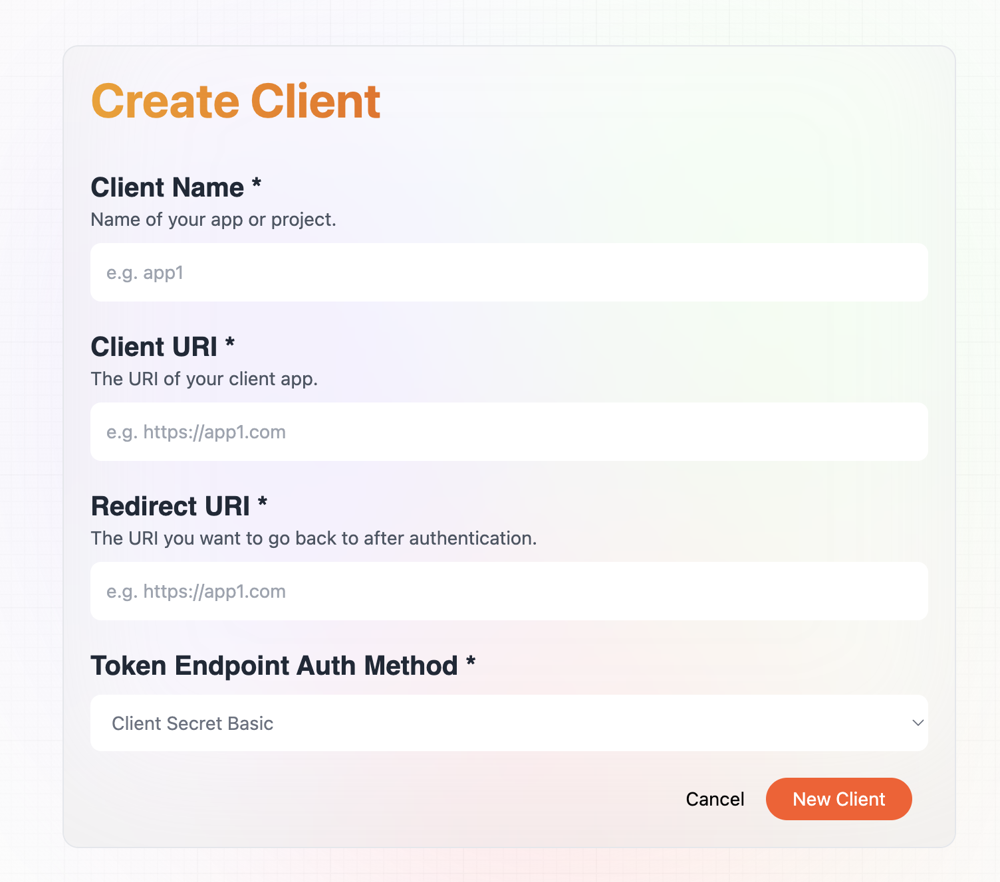
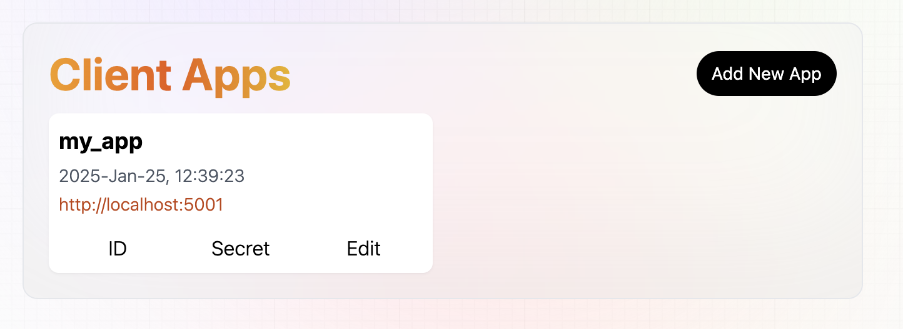
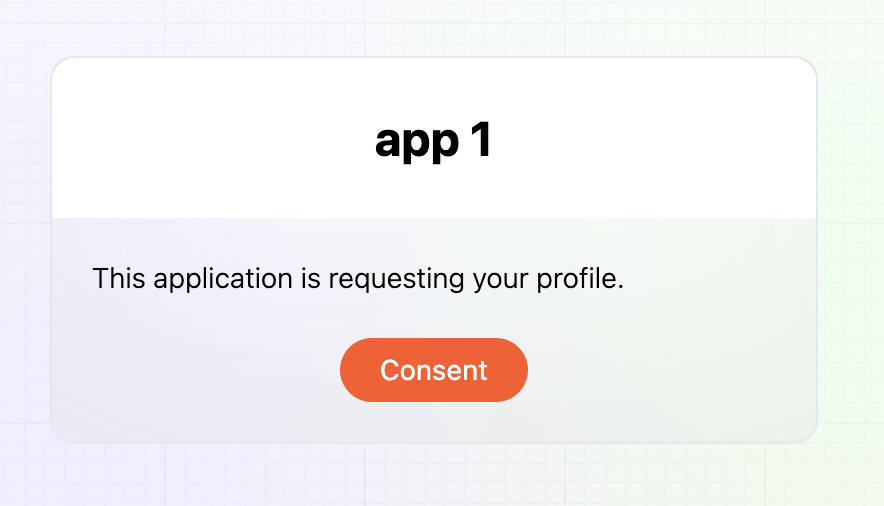

# Fidoauth

An Oauth 2.0 identity provider with FIDO2 authentication.


There are two parts to this project: the fidoauth service and the mock app.

# Fidoauth Service
The fidoauth service is the identity provider. It has a backend developed with Flask and a frontend developed with Next.js.

## Backend Setup
1. Go to the `fidoauth` directory.
``` bash
cd fidoauth
```

1. Create a conda environment (you can name it whatever you want, "oauth2" is just an example):
    ``` bash 
    conda create -n "oauth2"
    conda activate oauth2
    ```
1. Then install the dependencies:
    ``` bash 
    pip install -r requirements.txt
    ```
1. Make sure no other app is running on port 5000. 
1. Activate conda environment set up in the previous step:
    ``` bash 
    conda activate oauth2
    ```
1. Start the server:
    ``` bash 
    flask run
    ```
The fidoauth service backend should be running on http://localhost:5000

## Frontend Setup
1. Go to the `fidoauth/client` directory.
``` bash
cd fidoauth/client
```

1. Install the dependencies:
``` bash
yarn
```

1. Start the frontend:
``` bash
yarn dev
```

The fidoauth service frontend should be running on http://localhost:3000

# Sign Up for Fidoauth

1. Go to http://localhost:3000 and click "Create Account"

2. Fill in the form and click "Create Account"<br/>

3. The browser will prompt you to scan your FIDO2 device (it could be Apple's FaceID or TouchID,  or any other FIDO2 device)<br/>

4. After successful authentication, you will be redirected to the profile page<br/>


# Login to Fidoauth

1. Go to http://localhost:3000 and click "Login"
1. Fill in the `Personal ID` and click "Login"
1. The browser will prompt you to scan your FIDO2 device (it should be the same device you used to sign up)
1. After successful authentication, you will be redirected to the profile page

# Register an Application

Let's say you build an app that needs to access your user's data. You can register an application with Fidoauth and get an `application_id` and `application_secret`.

1. Login to Fidoauth and click `Add New App` in the `Client Apps` section<br/>

1. Fill in the form and click `New Client`<br/>


1. You will be redirected back to the profile page with the new client app added to the `Client Apps` section<br/>


1. Click `ID` and `Secret` to get the `application_id` and `application_secret`

1. You can now use the `application_id` and `application_secret` to authenticate your app with Fidoauth. For example, you can put them in the `.env` file of your app, then use them to get an access token. Here is an example of how to do that in JavaScript:

    The `.env` file should look like this:
    ```
    FIDOAUTH_ID=your_application_id
    FIDOAUTH_SECRET=your_application_secret
    ```

    An example of how to get an access token is shown below:
    ```javascript
    const getToken = async () => {
        let formData = new FormData();
        formData.append("grant_type", "authorization_code");
        formData.append("scope", "profile");
        formData.append("code", searchParams.get("code"));

        let config = {
        method: "POST",
        headers: {
            Accept: "*/*",
            Authorization:
            "Basic " +
            btoa(process.env.FIDOAUTH_ID + ":" + process.env.FIDOAUTH_SECRET),
        },
        body: formData,
        };

        try {
        const response = await fetch("http://127.0.0.1:3000/oauth/token", config);
        if (response?.ok) {
            const { access_token } = await response.json();
            setAccessToken(access_token);
            localStorage.setItem("fidoauth_token", access_token);
            setTimeout(() => {
            router.push("/");
            return;
            }, 2000);
        }
        } catch (error) {
        alert("Code invalid, please sign in again.");
        router.push("/");
        }
    };
    ```
# Login Your App with Fidoauth

1. Launch your app and activate the Fidoauth login flow
2. The browser will redirect you to Fidoauth consent page<br/>

3. After successful authentication, you will be redirected to your app
